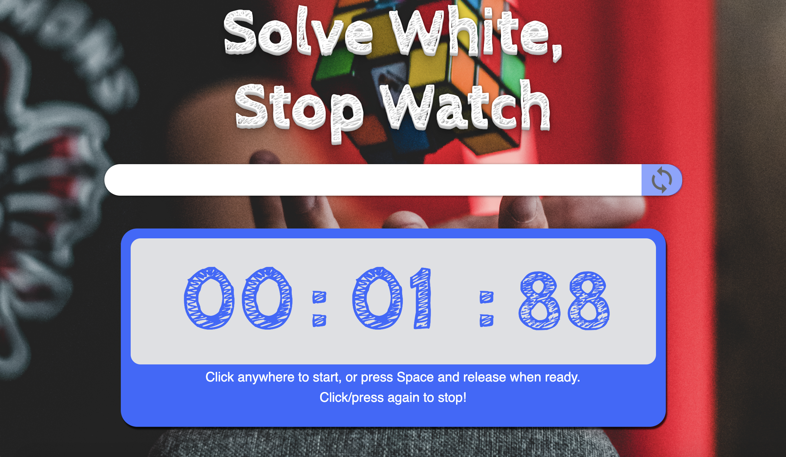
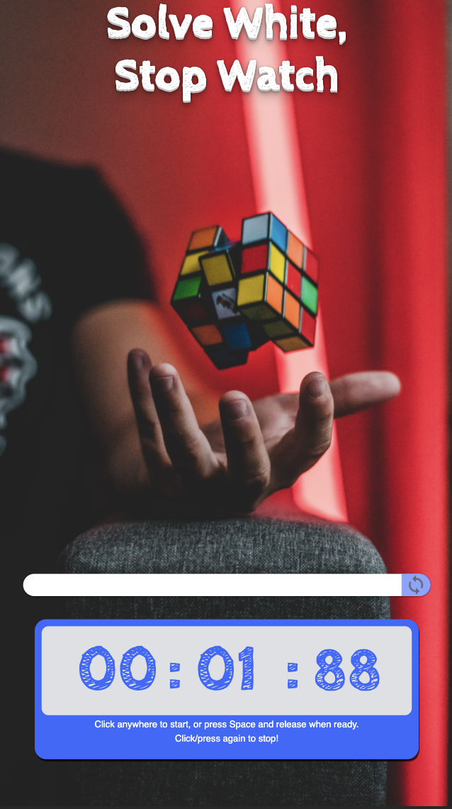

# SWSW: Solve White, Stop Watch

## Project Description
A Rubik's cube algorithm generator and stopwatch built out of HTML, CSS, and vanilla JavaScript. 
This project features a stopwatch designed for competition - accepting both clicks and space bar to stop and start the time, and with automatic resets on start - and also incorporates mobile-first design, to offer a better user experience to competitors who would need the ease of a mobile interface.
It also provides a scramble generator that adheres to the guidelines provided by the World Cube Association, so the user can have a properly randomized puzzle every time!

### Screenshots

&nbsp;

## Future Goals
In future iterations of this project we would like to...
* offer a an updated listing of user's best time, average score
* offer a database so users across platform can compare scores